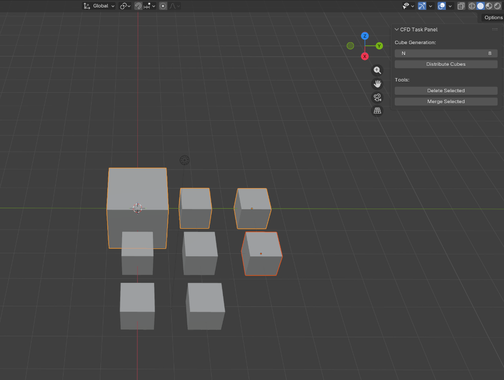

# CFD Developer Screening Tasks

## Overview

This repository contains the complete implementation for the CFD Developer screening tasks. The solution includes a Python-based Binary Tree Visualization System and a Blender Addon designed for CFD geometry preprocessing. Both tasks are fully implemented, tested, and ready for evaluation.

## Repository Summary

The repository is organized into two independent tasks:

Task 1 focuses on building a Python package for binary tree creation, manipulation, and visualization using a web-based dashboard.

Task 2 delivers a Blender 2.8+ addon that assists in CFD screening by providing tools for geometry distribution, merging, and cleanup.

Both tasks have been completed successfully.

## Task 1: Binary Tree Package and Visualization

Task 1 implements a reusable Python package named binary_tree that supports tree construction, traversal, serialization, and visualization.

### Key Capabilities

The package provides binary tree creation and manipulation features with support for general tree extensions. It includes YAML serialization to enable seamless data exchange between Python objects and configuration files. A web-based visualization dashboard built using Flask and D3.js allows interactive inspection of tree structures.

### Installation

The package can be installed locally from the task1 directory using pip.

```bash
pip install ./binary_tree
```

### Usage

Option A: Demo Execution
A demonstration script is provided to quickly generate a sample tree and launch the visualization dashboard.

```bash
python demo.py
```

This command creates an organization.yaml file, prints a visualization link, and starts the local web server automatically.

Option B: CLI-Based Visualization
The visualization server can also be started directly using the command-line interface.

```bash
binary-tree-viz
```

The dashboard will be accessible at [http://localhost:5000](http://localhost:5000).

### Visuals

*(Terminal Output showing tree structure and link generation)*


*(Interactive Web Dashboard)*

## Task 2: Blender CFD Addon

Task 2 delivers a Blender addon named cfd_addon, designed to streamline geometry preparation workflows for CFD screening tasks.

# Features

## Cube Distribution

The addon allows automatic generation of a specified number of cubes arranged in a grid layout for screening purposes.

## Delete Selected Objects

A utility tool to remove currently selected objects from the scene.

## Merge Selected Objects

Multiple mesh objects can be merged into a single mesh while automatically removing internal faces created due to overlapping or touching geometry.

# Installation Procedure

1. Launch Blender.
2. Navigate to Edit and then Preferences.
3. Open the Add-ons section.
4. Click the Install button located at the top right.
5. Select the cfd_addon.zip file from the task2 directory.
6. Enable the addon by checking the box labeled Object: CFD Screening Addon.

# Usage Instructions

The addon interface is accessible from the 3D View Sidebar. Press the N key to open the sidebar and select the CFD Task tab.

## Cube Generation

1. Adjust the slider to specify the number of cubes to generate.
2. Click the Distribute Cubes button to create the grid.

**  The maximum allowed value for cube generation is limited to 20 to ensure performance stability. **

# Object Tools

## Delete Selected

This option removes all currently selected objects from the scene.

## Merge Selected

1. Select two or more mesh objects that are touching or overlapping.
2. Click the Merge Selected button.

** The addon joins the selected meshes into a single object and removes internal faces created during the merge process. **

# Verification and Testing

To verify the functionality of the addon through automation:

1. Switch to the Scripting workspace in Blender.
2. Open the file task2/verify_addon_blender.py.
3. Execute the script.
4. Review the output in the System Console by selecting Window and then Toggle System Console.

** The console will display PASS or FAIL messages indicating the verification result. **


*(Blender Addon Interface)*

## Project Directory Structure

```text
.
├── demo.py                  # Demo script for Task 1
├── binary_tree/             # Task 1 source code
│   ├── binary_tree/         # Core package
│   │   ├── web/             # Web application using Flask and D3.js
│   ├── setup.py             # Package configuration
│   └── requirements.txt     # Dependency list
├── task2/                   # Task 2 source code
│   ├── cfd_addon/           # Blender addon source
│   ├── cfd_addon.zip        # Installable addon archive
│   └── verify_addon.py      # Verification script
└── README.md                # Repository documentation
```