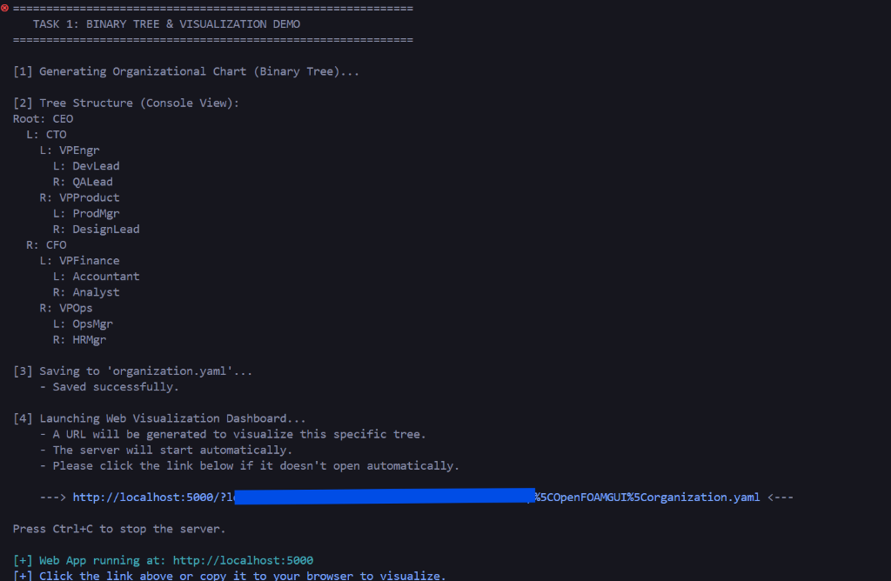
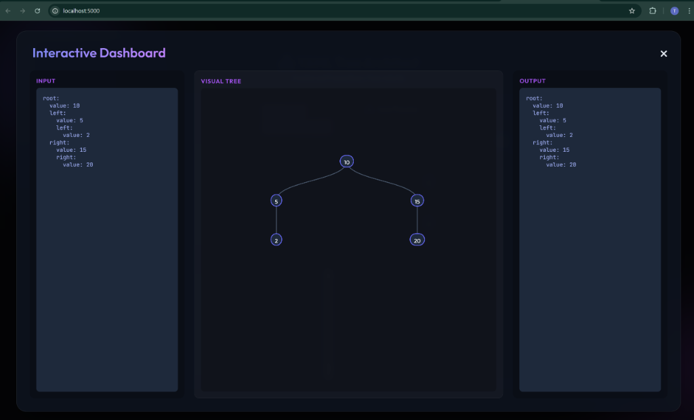

# Binary Tree Visualization Package

A robust Python package for creating, manipulating, and visualizing binary trees (and general trees). It features seamless YAML serialization and a built-in interactive web dashboard powered by D3.js.

## Features

- **Tree Management**: Create nodes, add children (Left/Right), and traverse structures.
- **Serialization**: Convert trees to YAML and back effortlessly.
- **Web Visualization**: One-command interactive dashboard to view your tree.
- **HTML/CSS/JS**: Beautiful, dark-mode UI with dynamic node resizing.

## Installation

To install this package locally:

```bash
pip install .
```

## Usage

### 1. Python API

```python
from binary_tree import create_tree, add_node, print_tree, write_tree_to_yaml, run_viz

# Create Tree
root = create_tree("Root")
add_node(root, "L", "Left Child")
add_node(root, "R", "Right Child")

# Print to Console
print_tree(root)

# Save to YAML
write_tree_to_yaml(root, "my_tree.yaml")

# Run Visualization Server
run_viz()
```

### 2. CLI Command

You can also start the visualization server directly from the terminal:

```bash
binary-tree-viz
```

## Visualization Demo

### Terminal Output
The tool generates a clickable link for your specific tree file:



### Interactive Dashboard
The web app renders the tree dynamically with zoom, pan, and collapsible nodes:



---

**Author**: Tanmay Yadav  
**Version**: 0.1.0
